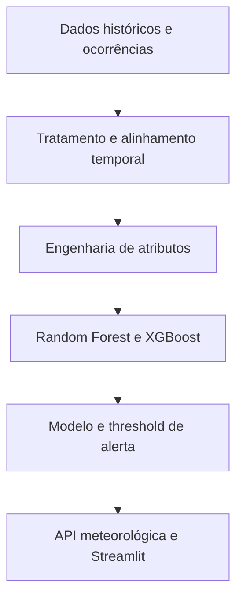
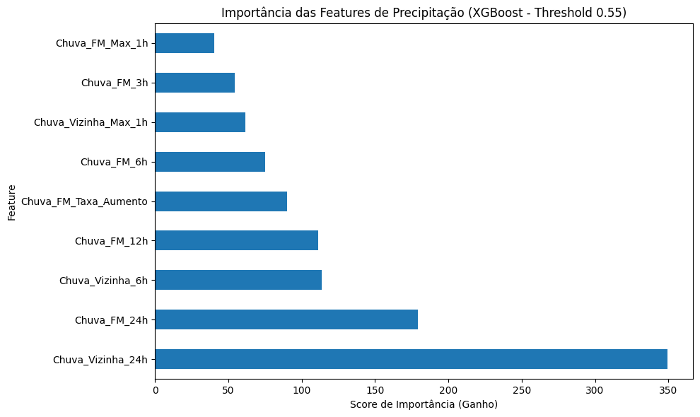
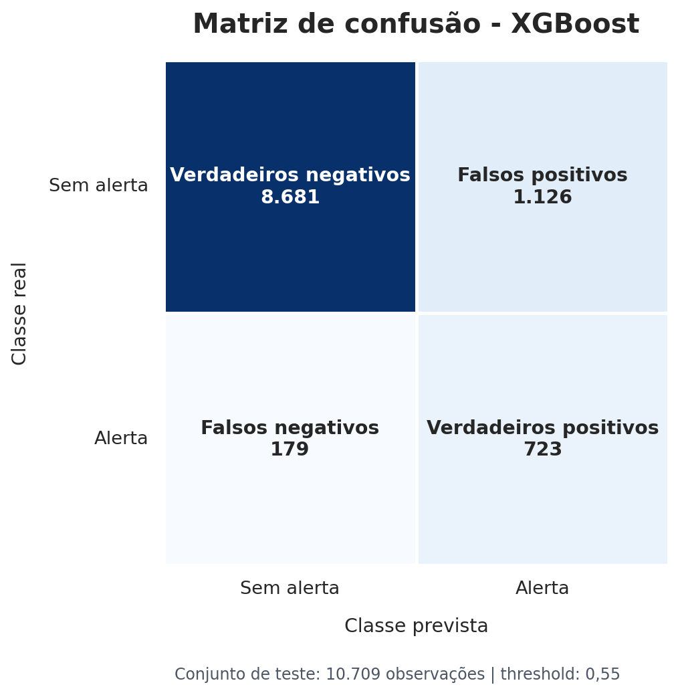
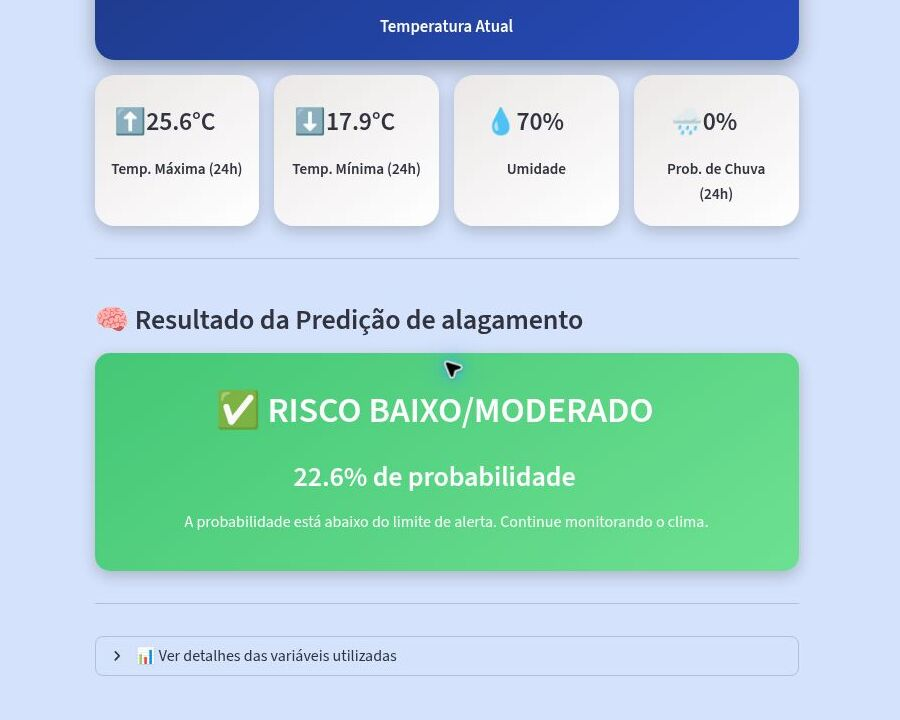

# Preditor de risco de enchentes e alagamentos

### Machine Learning aplicado à antecipação de eventos hidrológicos em Francisco Morato (SP)

[](https://www.python.org/)
[](https://xgboost.ai/)
[](https://streamlit.io/)
[](https://www.gov.br/cemaden/pt-br)
[](https://previsaoenchentefranciscomorato.streamlit.app/)

> Como transformar dados de chuva em um alerta compreensível, com antecedência suficiente para apoiar decisões preventivas?

Este projeto apresenta um pipeline completo de Ciência de Dados para estimar o risco de enchentes e alagamentos em **Francisco Morato**, município da Região Metropolitana de São Paulo historicamente afetado por chuvas intensas.

A solução integra dados pluviométricos, registros de ocorrências e previsões meteorológicas, aplica engenharia de atributos, compara modelos de classificação e disponibiliza o resultado em uma aplicação web. O foco não está apenas na acurácia: em um sistema preventivo, **deixar de identificar um evento real é mais grave do que emitir um alerta que não se confirma**. Por isso, o Recall da classe de risco foi adotado como métrica prioritária.

### [Acessar o preditor publicado](https://previsaoenchentefranciscomorato.streamlit.app/)


## O problema

Enchentes urbanas afetam moradias, comércio, mobilidade e segurança. Em Francisco Morato, a combinação entre relevo, ocupação urbana, impermeabilização do solo e chuvas intensas amplia a exposição da população a eventos hidrológicos extremos.

Alertas emitidos muito próximos da ocorrência reduzem o tempo disponível para retirar pertences, buscar locais seguros e organizar ações de resposta. A pesquisa com moradores apontou a necessidade de uma janela de até **48 horas**, requisito que orientou a construção do target, a engenharia de atributos e a experiência do aplicativo.

## O que foi desenvolvido

O projeto percorre o ciclo completo de uma solução de Machine Learning:

1. **Coleta de dados:** séries pluviométricas do Cemaden, registros oficiais de desastres e ocorrências complementares obtidas em fontes locais.
2. **Preparação:** padronização temporal, consolidação de sensores e tratamento de valores ausentes.
3. **Rotulagem:** expansão da janela dos eventos para representar risco nas 48 horas anteriores à ocorrência registrada.
4. **Engenharia de atributos:** cálculo de chuva acumulada, intensidade máxima, tendência de aumento e influência de municípios vizinhos.
5. **Modelagem:** comparação entre Random Forest e XGBoost com tratamento do desbalanceamento de classes.
6. **Avaliação:** análise de Recall, Precisão, F1-score, Acurácia e matriz de confusão.
7. **Produto:** serialização do modelo, integração com a OpenWeatherMap e publicação de uma interface em Streamlit.



## Dados e engenharia de atributos

A base final de modelagem reuniu **214.169 observações**, com registros pluviométricos em intervalos de dez minutos entre 2020 e 2025. O conjunto combinou sensores de Francisco Morato e municípios vizinhos para representar a dinâmica regional da chuva.

O modelo final utiliza nove variáveis:

| Dimensão | Variáveis |
|---|---|
| Chuva acumulada em Francisco Morato | 3h, 6h, 12h e 24h |
| Intensidade local | Maior precipitação em 1h |
| Chuva acumulada em municípios vizinhos | 6h e 24h |
| Intensidade regional | Maior precipitação vizinha em 1h |
| Tendência | Taxa de aumento da chuva em Francisco Morato |

A agregação regional é importante porque eventos observados em cidades próximas podem funcionar como sinal antecedente dentro da mesma dinâmica meteorológica.



## Modelagem e resultados

O problema foi formulado como uma classificação binária: **alerta** ou **sem alerta**. Como os eventos positivos são raros, a modelagem atribuiu maior peso à classe de risco e ajustou o limiar de decisão do XGBoost para **0,55**.

| Modelo | Precisão da classe de risco | Recall da classe de risco | F1-score | Acurácia |
|---|---:|---:|---:|---:|
| Random Forest | 0,32 | 0,77 | 0,45 | 0,84 |
| **XGBoost** | **0,39** | **0,80** | **0,53** | **0,88** |

O XGBoost identificou **723 das 902 observações positivas** presentes no conjunto de teste. O Recall de **0,80** representa uma evolução relevante frente ao primeiro modelo exploratório, que identificava apenas 22% dos casos positivos.



### Por que priorizar Recall?

Em aplicações de prevenção, os erros possuem custos diferentes:

- **Falso negativo:** existe risco, mas o sistema não alerta. É o erro mais crítico, pois pode reduzir a capacidade de proteção da população.
- **Falso positivo:** o sistema alerta, mas o evento não ocorre. Pode gerar desgaste, porém é menos grave do que deixar um desastre real sem sinalização.

A precisão de 0,39 mostra que ainda existem falsos alarmes. Esse resultado não deve ser ocultado: ele expressa o compromisso adotado entre sensibilidade e confiabilidade em um conjunto fortemente desbalanceado.

## Aplicação web

Ao selecionar **Consultar Risco de Enchente Agora**, a aplicação:

1. consulta as condições meteorológicas e a previsão de chuva para Francisco Morato e municípios vizinhos;
2. calcula as nove variáveis esperadas pelo modelo;
3. organiza os valores na mesma ordem usada no treinamento;
4. executa a inferência com o XGBoost serializado;
5. compara a probabilidade com o threshold de 55%;
6. apresenta o nível de risco em uma interface visual e responsiva.



*Exemplo de uma consulta ao aplicativo publicado. Os valores meteorológicos e a probabilidade são atualizados a cada execução.*

A interface traduz a saída probabilística do modelo em uma mensagem direta, mantendo as variáveis calculadas disponíveis para inspeção. O objetivo é tornar uma análise técnica compreensível também para pessoas sem familiaridade com Machine Learning.

## Impacto social

O principal valor do projeto está em aproximar dados ambientais de uma necessidade concreta da população. Uma ferramenta desse tipo pode contribuir para:

- ampliar o tempo disponível para ações preventivas;
- comunicar risco climático de maneira acessível;
- apoiar o monitoramento comunitário e a conscientização ambiental;
- complementar análises de órgãos responsáveis pela gestão de riscos;
- direcionar futuras integrações com pluviômetros, sensores e canais de notificação.

> **Aviso:** este é um protótipo acadêmico e experimental. Ele não substitui alertas oficiais, orientações da Defesa Civil ou sistemas operacionais do Cemaden. Em situações de risco, consulte sempre as autoridades competentes.

## Limitações e próximos passos

- A validação atual utiliza uma separação estratificada de 5% da base. Uma próxima versão deve adotar validação temporal em blocos para medir generalização em períodos futuros e reduzir o risco de vazamento entre observações próximas.
- O treinamento usa dados históricos de pluviômetros, enquanto a aplicação consome previsões meteorológicas por API. Essa diferença entre as fontes pode causar mudança de distribuição e deve ser monitorada.
- Parte dos rótulos depende de registros não oficiais, necessários para complementar eventos ausentes das bases formais, mas sujeitos a cobertura desigual.
- O modelo não incorpora novos eventos automaticamente. Retreinamento, monitoramento de drift e recalibração do threshold ainda precisam ser estruturados.
- A solução é específica para Francisco Morato e cidades vizinhas; sua aplicação em outros territórios exige novos dados e validação local.

Próximas evoluções naturais incluem validação temporal, monitoramento do modelo, integração direta com sensores locais, alertas por dispositivos móveis e mapas de risco por área.

## Tecnologias

- **Python**, **pandas** e **NumPy** para preparação dos dados.
- **scikit-learn** para divisão, métricas e modelo de referência.
- **XGBoost** para o classificador final.
- **Matplotlib** e **Seaborn** para análise visual.
- **Joblib** para serialização do modelo e das features.
- **OpenWeatherMap API** para dados meteorológicos utilizados na inferência.
- **Streamlit** e **Streamlit Community Cloud** para interface e deploy.
- **Git/GitHub** para versionamento.

## Estrutura do repositório

```text
analise_climatica/
├── data/raw/                                  # Dados pluviométricos e ocorrências
├── docs/images/                               # Imagens utilizadas no README
├── notebooks/
│   ├── 01-exploracao.ipynb                    # Exploração das fontes de dados
│   ├── 02-exploracao.ipynb                    # Tratamento, rotulagem e Random Forest
│   └── 03-exploracao.ipynb                    # Feature engineering e modelo XGBoost
├── preditor_enchente/
│   ├── .streamlit/config.toml                 # Configuração visual do Streamlit
│   ├── api_data_collector.py                  # Consulta da API e cálculo das features
│   ├── app.py                                 # Aplicação web
│   ├── features_cols.joblib                   # Ordem das variáveis do modelo
│   ├── modelo_enchente_final_xgb.joblib       # Modelo treinado
│   └── style.css                              # Estilos da interface
├── requirements.txt
└── README.md
```

## Como executar localmente

```bash
git clone https://github.com/joaohs1/analise_climatica.git
cd analise_climatica

python -m venv .venv
source .venv/bin/activate  # Windows: .venv\Scripts\activate

pip install streamlit pandas numpy scikit-learn xgboost joblib requests
```

Crie o arquivo `preditor_enchente/.streamlit/secrets.toml`:

```toml
[api]
chave_tempo = "SUA_CHAVE_DA_OPENWEATHERMAP"
```

Depois, execute:

```bash
cd preditor_enchente
streamlit run app.py
```

## Contexto acadêmico

Projeto desenvolvido como parte do **Projeto Integrador IV** da Universidade Virtual do Estado de São Paulo - UNIVESP, conectando Ciência de Dados, prevenção de desastres e desenvolvimento de produto.

---

Se este projeto ajudou você a compreender uma aplicação social de Machine Learning, considere deixar uma ⭐ no repositório.
